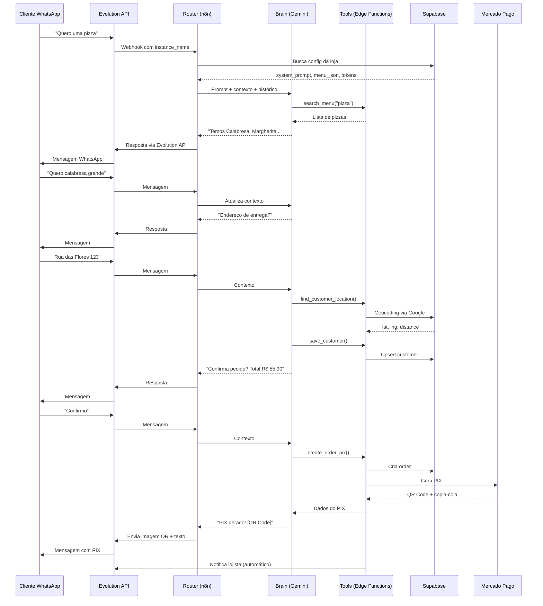

# 🤖 VilaFood WhatsApp AI Agent - Arquitetura n8n Multi-Tenant

## Visão Geral

Este documento descreve a arquitetura do agente IA do VilaFood para WhatsApp, baseado nos fluxos n8n de referência, adaptado para operação multi-tenant onde múltiplos estabelecimentos compartilham a mesma infraestrutura.

---

## 📊 Arquitetura de 3 Camadas

```
┌─────────────────────────────────────────────────────────────────┐
│                    CAMADA 1: MASTER ROUTER                       │
│  Evolution API Webhook → Identifica Loja → Busca Config no DB   │
└─────────────────────────────────────────────────────────────────┘
                              │
                              ▼
┌─────────────────────────────────────────────────────────────────┐
│                   CAMADA 2: VILAFOOD AI BRAIN                    │
│  Gemini + Prompt Dinâmico + Menu JSON + Memory por Conversa     │
└─────────────────────────────────────────────────────────────────┘
                              │
                              ▼
┌─────────────────────────────────────────────────────────────────┐
│                      CAMADA 3: TOOLS                             │
│  save_customer | create_order_pix | send_product_photo | ...    │
└─────────────────────────────────────────────────────────────────┘
```

---

## 🔧 CAMADA 1: Master Router

### Trigger: Evolution API Webhook

Recebe todas as mensagens de todas as instâncias WhatsApp.

**Dados recebidos:**
```json
{
  "instance": "pizzaria_do_joao",
  "data": {
    "key": {
      "remoteJid": "5586999999999@s.whatsapp.net",
      "fromMe": false,
      "id": "MSG_ID"
    },
    "message": {
      "conversation": "Quero uma pizza grande"
    },
    "pushName": "João Cliente"
  }
}
```

### Identificação do Estabelecimento

```sql
-- Busca config da loja pelo instance_name
SELECT 
  id,
  name,
  whatsapp_instance_name,
  evolution_api_token,
  system_prompt,
  menu_json,
  mercado_pago_token,
  latitude,
  longitude,
  address,
  operating_hours
FROM establishments
WHERE whatsapp_instance_name = 'pizzaria_do_joao'
```

### Debounce de Mensagens (Redis)

Para agrupar múltiplas mensagens em uma só:

```javascript
// Push mensagem para lista Redis
RPUSH msgs-5586999999999 "Quero uma pizza grande"
// Aguarda 1 segundo
WAIT 1s
// Busca todas as mensagens
LRANGE msgs-5586999999999 0 -1
// Limpa a lista
DEL msgs-5586999999999
// Junta mensagens
messages.join(' ')
```

---

## 🧠 CAMADA 2: VilaFood AI Brain

### System Prompt Dinâmico (Template)

```markdown
## Configuração do Agente de Atendimento – {{ establishment.name }}

Você é um agente de atendimento de {{ establishment.segment_name }} que realiza entregas por delivery. 
Seu objetivo é auxiliar o cliente na escolha dos produtos, criar o pedido e processar o pagamento.

---

### Dados do Estabelecimento

- Nome: {{ establishment.name }}
- Endereço: {{ establishment.address }}
- WhatsApp: {{ establishment.whatsapp }}
- Horário: {{ operating_hours_formatted }}

---

### Cardápio

{{ menu_json_formatted }}

---

### Regras Gerais

- Nunca confirme ações sem chamar as tools correspondentes.
- Use o histórico da conversa para lembrar preferências.
- Seja direto e objetivo nas respostas.
- Nunca envie o pedido antes de confirmar se está tudo correto.
- Nunca use markdown, emojis excessivos ou caracteres especiais.

---

### Tom de Voz

- Use frases curtas e naturais:
  - "Que sabor deseja?"
  - "Algo mais?"
  - "Deseja qual tamanho?"
- Ao listar produtos, cite no máximo 3 itens por vez.
- Finalize com "e outras opções..." ou "e muitos outros..."

---

### Dados do Cliente

Nome: {{ customer.name || "não informado" }}
Telefone: {{ customer.phone }}
Endereço: {{ customer.address || "não informado" }}

---

### Contexto Atual

- Data/Hora: {{ now.format('yyyy-MM-dd HH:mm:ss') }}
- Dia da Semana: {{ now.weekdayLong }}

---

### Tarefas do Agente

1. **Auxiliar na escolha dos produtos**
   - Use a tool `search_menu` para buscar produtos
   - Liste no máximo 3 opções por vez
   - Mostre fotos com `send_product_photo` quando solicitado

2. **Montar lista de produtos**
   - Nome, quantidade, preço unitário, total

3. **Verificar endereço de entrega**
   - Use `find_customer_location` para validar/geocodificar

4. **Salvar dados do cliente**
   - Use `save_customer` com: name, phone, address, lat, long

5. **Confirmar pedido final**
   - Liste todos os itens, endereço, valor total
   - Pergunte: "Está tudo certo? Posso confirmar?"

6. **Calcular taxa de entrega**
   - Usar distância do cliente × taxa_por_km do estabelecimento

7. **Gerar PIX para pagamento**
   - Use `create_order_pix` após confirmação
   - Informe que será gerado QR Code

8. **Enviar pedido ao lojista**
   - Use `send_order_to_owner` com resumo completo

9. **Confirmar ao cliente**
   - Informe que pedido foi enviado
   - Tempo estimado de entrega

---

### Histórico da Conversa

{{ chat_history }}
```

### Configuração do LLM

```json
{
  "model": "google/gemini-2.5-flash",
  "temperature": 0.1,
  "max_tokens": 1024
}
```

### Memory (Redis ou Window Buffer)

Chave de isolamento: `{instance_name}:{remote_jid}`

```javascript
// Exemplo: pizzaria_do_joao:5586999999999
const sessionKey = `${instance_name}:${remoteJid.replace('@s.whatsapp.net', '')}`;
```

---

## 🛠️ CAMADA 3: Tools

### 1. search_menu

Busca produtos no cardápio usando menu_json ou RAG.

**Parâmetros:**
```json
{
  "query": "pizza calabresa"
}
```

**Implementação VilaFood:**
```typescript
// Edge Function: whatsapp-ai-response
// Já implementado - busca em menu_json do estabelecimento
```

### 2. send_product_photo

Envia foto do produto via Evolution API.

**Parâmetros:**
```json
{
  "product_id": "uuid",
  "remote_jid": "5586999999999@s.whatsapp.net"
}
```

**Implementação VilaFood:**
```typescript
// Edge Function: whatsapp-send-media
POST /functions/v1/whatsapp-send-media
{
  "establishment_id": "uuid",
  "remote_jid": "5586999999999@s.whatsapp.net",
  "media_type": "image",
  "media_url": "https://cloudfront.../product.jpg",
  "caption": "Pizza Calabresa - R$ 45,90"
}
```

### 3. save_customer

Salva/atualiza dados do cliente no Supabase.

**Parâmetros:**
```json
{
  "name": "João Silva",
  "phone": "5586999999999",
  "email": "joao@email.com",
  "address": "Rua das Flores, 123 - Centro",
  "lat": -5.089,
  "lng": -42.801,
  "city": "Teresina",
  "uf": "PI",
  "cep": "64000-000"
}
```

**Implementação VilaFood:**
```typescript
// Edge Function: whatsapp-cart (já tem save_customer)
// Ou criar nova: whatsapp-customer
```

### 4. find_customer_location

Geocodifica endereço usando Google Maps API.

**Parâmetros:**
```json
{
  "address": "Rua das Flores, 123 - Centro, Teresina - PI"
}
```

**Implementação VilaFood:**
```typescript
// Edge Function: calculate-delivery (já faz geocoding)
// Retorna: lat, lng, formatted_address, distance_km
```

### 5. create_order_pix

Cria pedido e gera PIX do Mercado Pago.

**Parâmetros:**
```json
{
  "items": [
    {"product_id": "uuid", "name": "Pizza Calabresa", "quantity": 1, "price": 45.90}
  ],
  "delivery_address": {
    "street": "Rua das Flores",
    "number": "123",
    "neighborhood": "Centro",
    "city": "Teresina",
    "cep": "64000-000",
    "lat": -5.089,
    "lng": -42.801
  },
  "delivery_type": "delivery",
  "customer_name": "João Silva",
  "customer_phone": "5586999999999"
}
```

**Implementação VilaFood:**
```typescript
// Edge Function: whatsapp-checkout (já implementado com generate_pix: true)
POST /functions/v1/whatsapp-checkout
{
  "instance_name": "pizzaria_do_joao",
  "remote_jid": "5586999999999@s.whatsapp.net",
  "cart": [...],
  "delivery_type": "delivery",
  "payment_method": "pix",
  "delivery_address": {...},
  "generate_pix": true
}
```

### 6. send_order_to_owner

Envia resumo do pedido para o WhatsApp do lojista.

**Parâmetros:**
```json
{
  "order_id": "uuid",
  "message": "🆕 Novo Pedido #123\n\nCliente: João Silva\n..."
}
```

**Implementação VilaFood:**
```typescript
// Edge Function: whatsapp-order-notifications (já implementado)
// Envia automaticamente quando pedido é criado
```

### 7. get_chat_history

Busca histórico de conversas para contexto.

**Parâmetros:**
```json
{
  "phone": "5586999999999",
  "limit": 20
}
```

**Implementação VilaFood:**
```typescript
// Edge Function: whatsapp-ai-response
// Já busca de whatsapp_messages automaticamente
```

---

## 📱 Fluxo Completo de Conversa



---

## 🗄️ Tabelas Supabase Necessárias

### establishments (campos adicionais)

```sql
whatsapp_instance_name VARCHAR UNIQUE,  -- Nome da instância Evolution
evolution_api_token TEXT,               -- Token da instância
system_prompt TEXT,                     -- Prompt personalizado
menu_json JSONB,                        -- Cardápio em JSON
gemini_api_key TEXT                     -- Opcional: chave própria
```

### whatsapp_sessions

```sql
id UUID PRIMARY KEY,
establishment_id UUID REFERENCES establishments,
customer_phone VARCHAR,
customer_name VARCHAR,
remote_jid VARCHAR,
cart JSONB DEFAULT '[]',
context JSONB DEFAULT '{}',
last_message_at TIMESTAMP,
created_at TIMESTAMP DEFAULT now()
```

### whatsapp_messages

```sql
id UUID PRIMARY KEY,
establishment_id UUID,
session_id UUID,
remote_jid VARCHAR,
direction VARCHAR, -- 'incoming' | 'outgoing'
message_type VARCHAR, -- 'text' | 'image' | 'audio'
content TEXT,
metadata JSONB,
created_at TIMESTAMP DEFAULT now()
```

---

## 🔄 Templates n8n Disponíveis

Os templates foram criados em `docs/n8n-templates/`:

### 1. VilaFood-Agent-Complete.json ⭐ PRINCIPAL

Fluxo completo com todas as funcionalidades:

- **Evolution API Webhook** - Recebe mensagens
- **Filter Self Messages** - Ignora mensagens próprias
- **Extract Message Fields** - Extrai dados da mensagem
- **Get Establishment Config** - Busca config via Edge Function
- **Redis Debounce** - Agrupa mensagens (Push → Wait 2s → Get → Clear)
- **Get Chat History** - Histórico da conversa
- **VilaFood AI Agent** - Agente com Gemini + Tools
- **Send Response** - Envia resposta via Evolution API
- **Log AI Response** - Registra no Supabase

**Tools incluídas:**
- `search_menu` - Busca produtos no cardápio
- `send_product_photo` - Envia foto do produto
- `add_to_cart` - Adiciona ao carrinho
- `save_customer` - Salva dados do cliente
- `find_google_maps` - Geocodifica endereço
- `create_order_pix` - Cria pedido + PIX
- `send_order_to_owner` - Notifica lojista
- `send_pix_qrcode` - Envia QR Code PIX

### 2. VilaFood-MercadoPago-PIX.json

Sub-workflow para geração de PIX:

- Recebe dados do cliente e pedido
- Chama API Mercado Pago
- Retorna QR Code base64 + código copia-cola

---

## 🚀 Como Usar

### 1. Importar no n8n

1. Acesse seu n8n
2. Vá em Workflows → Import
3. Cole o JSON do template

### 2. Configurar Credenciais

Crie as seguintes credenciais no n8n:

**Supabase API:**
```json
{
  "url": "https://db.vilafood.delivery",
  "serviceRoleKey": "sua-service-role-key"
}
```

**Redis Account:**
```json
{
  "host": "seu-redis-host",
  "port": 6379,
  "password": "sua-senha"
}
```

**Google Gemini:**
```json
{
  "apiKey": "sua-google-ai-api-key"
}
```

### 3. Configurar Webhook no Evolution API

Configure cada instância para enviar webhooks para:

```
https://seu-n8n.com/webhook/vilafood-webhook
```

Eventos habilitados:
- `messages.upsert`
- `connection.update`

### 4. Configurar Estabelecimentos

No Supabase, preencha para cada estabelecimento:

```sql
UPDATE establishments SET
  whatsapp_instance_name = 'nome_instancia',
  evolution_api_token = 'token_evolution',
  system_prompt = 'Você é um assistente...',
  menu_json = '[{"id":"uuid","nome":"Pizza","preco":45.90,"img_url":"https://..."}]'
WHERE id = 'establishment-uuid';
```

---

## 📊 Edge Functions Usadas

| Tool | Edge Function | Endpoint |
|------|---------------|----------|
| get_session | whatsapp-cart | `POST /functions/v1/whatsapp-cart` |
| add_to_cart | whatsapp-cart | `POST /functions/v1/whatsapp-cart` |
| save_customer | whatsapp-cart | `POST /functions/v1/whatsapp-cart` |
| create_order | whatsapp-checkout | `POST /functions/v1/whatsapp-checkout` |
| find_location | calculate-delivery | `POST /functions/v1/calculate-delivery` |
| send_media | evolution-api | `POST {server_url}/message/sendMedia/{instance}` |

---

## ⚠️ Requisitos

- n8n v1.x+
- Redis para debounce e memory
- Evolution API v2.x
- Supabase com Edge Functions deployadas
- Google Gemini API Key (ou usar Lovable AI Gateway)
2. Busca histórico de chat
3. Busca dados do cliente
4. Executa LLM com tools
5. Retorna resposta

### 3. VilaFood-Tools-Customer

**Trigger:** Chamado como Tool
**Ações:**
- get_or_create: Busca/cria customer
- update: Atualiza dados
- find_location: Geocodifica

### 4. VilaFood-Tools-Order

**Trigger:** Chamado como Tool
**Ações:**
- create_order_pix: Cria pedido + PIX
- cancel_order: Cancela pedido

### 5. VilaFood-FollowUp

**Trigger:** Cron cada 5 min
**Ações:**
1. Busca conversas pendentes
2. Classifica se precisa follow-up
3. Envia mensagem de retomada

---

## 🚀 Deploy

### Edge Functions VilaFood (já implementadas)

- ✅ `whatsapp-ai-response` - Brain com Lovable AI
- ✅ `whatsapp-send-media` - Envio de imagens
- ✅ `whatsapp-checkout` - Criação de pedido + PIX
- ✅ `whatsapp-cart` - Gerenciamento de carrinho
- ✅ `calculate-delivery` - Cálculo de frete
- ✅ `mercadopago-pix` - Geração de PIX
- ✅ `whatsapp-order-notifications` - Notificação ao lojista

### n8n Workflows

Importar os JSONs adaptados para multi-tenant:
1. Substituir hardcoded values por queries dinâmicas
2. Usar `instance_name` para identificar loja
3. Buscar tokens/config do Supabase em runtime

---

## 📝 Checklist de Implementação

- [x] Campos whatsapp_instance_name, evolution_api_token, system_prompt no DB
- [x] Edge Function whatsapp-ai-response com prompt dinâmico
- [x] Edge Function whatsapp-send-media multi-tenant
- [x] Edge Function whatsapp-checkout com PIX automático
- [x] Memory isolada por instance_name + remoteJid
- [ ] Workflow n8n Master Router
- [ ] Workflow n8n AI Brain
- [ ] Workflow n8n Tools (Customer, Order)
- [ ] Workflow n8n FollowUp
- [ ] UI: Config whatsapp_instance_name no painel
- [ ] UI: Editor de system_prompt
- [ ] UI: Visualizador de menu_json
